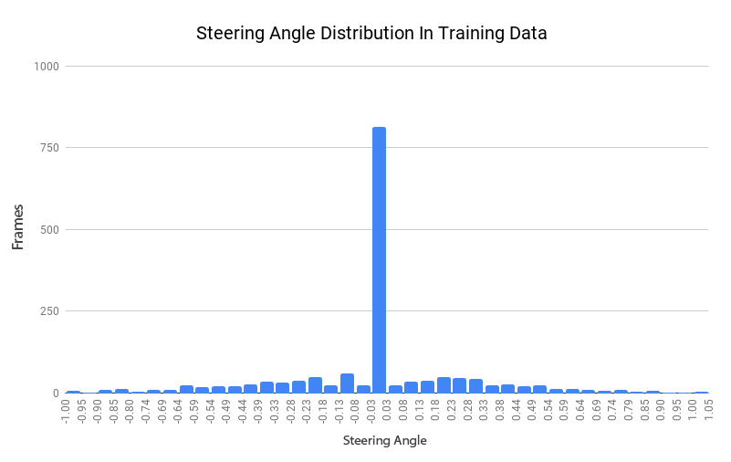

# Simulation-of-Autonomous-Vehicles-In-Unity

## Contributors

[Tony Alas](https://github.com/tonyalas)

[Mitchell Sturba](https://github.com/MitchellSturba)

## Overview

A major project for the 4990A course where we simulate autonomous vehicles in the Unity game engine. This project uses methodologies from the <a href="https://github.com/udacity/self-driving-car-sim">Udacity Car Simulator</a> and Microsoft's <a href="https://github.com/microsoft/airsim">Airsim</a>. Autonomous vehicles require a large amount of data that can be complex and expensive to collect in the real world. The ability to simulate autonomous vehicles in a photorealistic environment provides a much more cost effective and efficient way to generate useful data.
 

## Demo

 
The gif above shows a short clip of the simulated vehicle driving fully autonomously through a trained model. There are three mounted cameras on the hood of the car that feed images into the model and receives steering predictions and speed/throttle/break  instructions in order to safely maneuver around curved roads and remain safely in the lane.

## Setup
Download <a href="https://www.anaconda.com/products/individual">Anaconda</a>  
Download <a href="https://unity3d.com/get-unity/download/archive">Unity 2020.1.10f1</a>  
Navigate to pythontest\reflex_behaviour and run 
 
`conda enc create -f environment.yml`  
`conda activate self_driving`  
`python drive.py models/model_500`

## Training your own model
In order to train your own model make sure training is flicked on in the upper left corner, then select the folder you'd like to store the images/data in. Next hit the record button and drive around manually collecting data. When finished hit the record button again and the program will save the photos and .csv file in the folder specified. When collecting the data, images are collected from the three cameras mounted on the car's hood and when the model is being trained it is processed and fed through the convolutional neural network to learn how to make predictions in real time. When ready to train, run `python train.py -d <directory>`
  

## Data
The data this model was trained on represents a larger proportion of turns in the road in order to avoid a biased towards always driving straight, however it should be noted that the most common steering angle is still 0 since the vehicle always moves forward and is trained to stay within the lanes as best as possible. The data was gathered from the 'Windridge City' scene by a human controlling the car with a keyboard (although a joystick would yield better results) where frames and steering angles were stored in memory.

