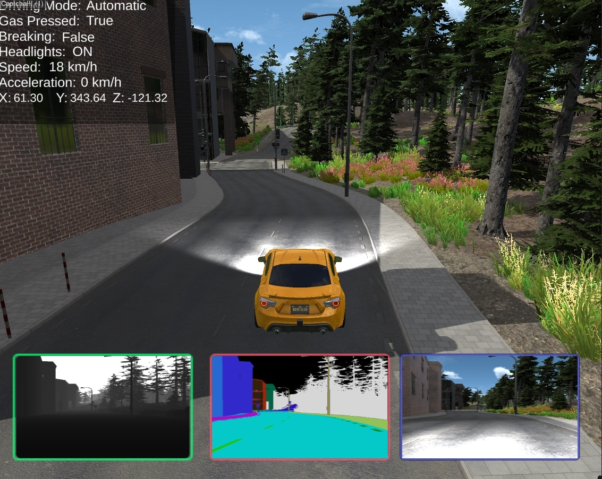

# Simulation-of-Autonomous-Vehicles-In-Unity

## Contributors:

[Tony Alas](https://github.com/tonyalas)

[Mitchell Sturba](https://github.com/MitchellSturba)

A major project for the 4990A course where we simulate autonomous vehicles in the Unity game engine with emphasis on localization 

